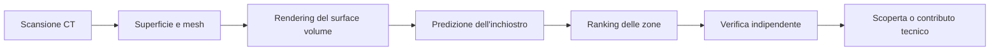

# Procedura operativa canonica

**Stato: bozza operativa da sottoporre a revisione incrociata.** Questa procedura governa il lavoro di PapyrusLab dalla scelta di un problema fino a una possibile candidatura. I singoli esperimenti avranno un piano eseguibile separato in `docs/plans/`, scritto sul commit esatto da cui partiranno.

## Obiettivo e principio guida

L'obiettivo è aumentare la probabilità di produrre un risultato reale, riproducibile e utile alla Vesuvius Challenge. Ogni conclusione deve poter essere ricondotta a dati, versione del software, configurazione, output originale e controllo umano.

La catena tecnica è:



Un errore a monte può propagarsi fino alla fine. Prima di modificare il modello o il ranking, controllare input e geometria. Un risultato interessante viene promosso soltanto se supera i controlli pertinenti al passaggio che lo ha prodotto.

## Ruoli

- **Matteo:** responsabile delle priorità, delle decisioni che cambiano il perimetro e delle azioni esterne come candidature, pubblicazioni, spese e inviti.
- **Socio:** secondo operatore del team, replica procedure e svolge valutazioni indipendenti quando assegnato. Il Mac M3 Pro non implica automaticamente compatibilità o prestazioni: si misura sul campione comune.
- **Esecutore:** persona o agente che prepara il piano approvato, esegue la prova e raccoglie gli artefatti.
- **Revisore:** persona o agente che legge piano, diff, manifest, output e risultati senza modificare gli stessi file. Cerca errori, alternative e conclusioni più ampie dell'evidenza.
- **Francesco e community:** fonti esterne indipendenti. I loro contributi vengono attribuiti, controllati e confrontati; non ricevono compiti o responsabilità del team.

Claude e Codex non hanno ruoli permanenti nel progetto. Per ogni attività Matteo decide come combinarli in base a quattro elementi: ampiezza del contesto, tipo e importanza del compito, valore di un controllo indipendente e disponibilità dei rispettivi budget. Entrambi possono progettare, eseguire o revisionare; per un compito importante può essere utile che uno produca il lavoro e l'altro lo controlli, mentre una sessione lunga può passare dall'uno all'altro su un commit coerente. La modalità scelta viene registrata prima del lavoro. Vale sempre una delle tre configurazioni sicure: un solo writer con revisore in sola lettura, staffetta su un commit, oppure worktree distinti per lavori realmente indipendenti. Due agenti non scrivono contemporaneamente nella stessa cartella.

### Scelta della combinazione per attività

| Situazione | Combinazione possibile, da decidere allora |
|---|---|
| Organizzazione, documentazione o analisi ampia | Un agente mantiene il quadro complessivo e scrive; l'altro interviene soltanto se aggiunge un controllo concreto |
| Implementazione circoscritta | Un agente esegue il piano congelato; l'altro può revisionare diff e test |
| Decisione importante o risultato candidato | Secondo parere indipendente oppure revisione incrociata, senza mostrare prima la conclusione dell'altro quando serve evitare condizionamenti |
| Limite di utilizzo o sessione molto lunga | Staffetta su commit, con consegna autosufficiente e stato verificato |
| Due filoni realmente indipendenti | Worktree separati, percorsi posseduti e integrazione successiva |

La tabella descrive opzioni e non assegna in anticipo Claude o Codex a una colonna. Prima del lavoro si registrano agente, ruolo, perimetro, output e condizione di arresto.

## Gerarchia delle evidenze

Ogni affermazione durevole deve indicare a quale livello appartiene:

| Livello | Significato | Formulazione ammessa |
|---|---|---|
| E0 — fonte ufficiale | Regola, dato o procedura pubblicata dagli organizzatori | “La pagina ufficiale richiede…” |
| E1 — risultato esterno | Misura o affermazione di un altro autore | “L'autore riporta…” |
| E2 — ispezione del team | Codice, file o interfaccia controllati senza eseguire la prova | “Abbiamo verificato nel codice…” |
| E3 — replica operativa | Pipeline esterna eseguita dal team sullo stesso caso | “Abbiamo riprodotto…” |
| E4 — confronto controllato | Baseline e variante confrontate su dati e criteri fissati | “La variante migliora su…” |
| E5 — verifica indipendente | Risultato congelato valutato su dati non usati per le scelte | “Il risultato si mantiene sul test…” |

Un livello non eredita automaticamente il successivo. Un repository letto non è una pipeline replicata; una replica non dimostra generalizzazione; una predizione stabile non equivale a lettere leggibili.

## Stati del progetto e criteri di passaggio

| Gate | Stato richiesto | Evidenza per superarlo |
|---|---|---|
| G0 — comprensione | Il team distingue scansione, superficie, render, predizione e lettura | Spiegazione condivisa e prima sessione guidata completata |
| G1 — ambiente | Un piccolo notebook usa l'acceleratore previsto e registra versioni e risorse | Preflight salvato e controllo E00 completato |
| G2 — riproducibilità | Il secondo operatore ottiene un risultato equivalente dalle istruzioni | E01 con differenze entro la tolleranza dichiarata |
| G3 — valutazione valida | Esistono dati di sviluppo e verifica, baselines e metriche adatte | Manifest E02 congelato prima dell'ottimizzazione |
| G4 — miglioramento | Una modifica supera la baseline a costo comparabile | Confronto E03/E04 e revisione incrociata accettata |
| G5 — candidato | Una zona di un volume eleggibile supera controlli tecnici e umani | E06 ripetuta, coordinate e artefatti originali conservati |
| G6 — candidatura | Requisiti correnti del premio e pacchetto di evidenze completi | Audit finale e decisione esplicita di Matteo |

Non saltare un gate chiamando “esplorazione” un test incompleto. È possibile svolgere piccole prove tecniche mentre si prepara G3, ma i loro risultati restano controlli operativi.

## Ciclo di ogni esperimento

### 1. Intake e ricerca mirata

Definire la domanda concreta e il componente interessato: dati, geometria, rendering, modello, ranking o verifica. Consultare `docs/06-ricerca-community.md`, aggiornamenti ufficiali e contributi pertinenti. Cercare soluzioni equivalenti, correzioni già integrate a monte e condizioni di licenza.

Output: breve elenco delle fonti rilevanti, revisione esatta, beneficio dichiarato e rischio principale. La ricerca si ferma quando abbiamo abbastanza informazione per scegliere la prova più piccola che distingue le alternative.

### 2. Piano eseguibile e preregistrazione

Creare `docs/plans/AAAA-MM-GG-<argomento>.md` usando un commit pulito come punto di partenza. Il piano deve contenere:

- domanda e ipotesi;
- baseline e singola modifica principale;
- campioni, coordinate e ruolo di ciascun dato;
- evidenza di separazione fra training, sviluppo e verifica;
- software, checkpoint, seed, direzione, profondità e scala;
- hardware previsto e ambiente;
- limite di tempo, GPU, spazio, trasferimenti ed eventuale costo;
- output attesi, metriche, tolleranze e controlli;
- criterio deciso prima della prova per accettare o respingere l'ipotesi;
- condizioni di arresto e procedura di recupero;
- responsabile dell'esecuzione e revisore.

Prima dell'esecuzione verificare che `git rev-parse HEAD` coincida con il commit dichiarato. Se il codice o il piano cambiano, congelare una nuova revisione; non correggere silenziosamente la procedura durante il run.

### 3. Preflight

Eseguire inizialmente controlli che non consumano GPU:

1. verificare identità, dimensioni, ordine degli assi, scala fisica e hash degli input;
2. verificare spazio libero e destinazione degli output;
3. registrare commit del progetto e delle dipendenze;
4. controllare che dati, modelli e output voluminosi siano esclusi da Git;
5. eseguire import e comando di aiuto del software;
6. preparare una prova minima su un sottoinsieme;
7. attivare la GPU soltanto quando download e configurazione sono pronti;
8. verificare che il framework riconosca davvero l'acceleratore e registrarne il modello.

Un notebook che termina senza errori non supera il preflight scientifico: occorre controllare forma, orientamento e contenuto dell'output.

### 4. Esecuzione controllata

Lanciare prima la baseline, poi la variante. Usare gli stessi input e lo stesso budget quando il confronto lo richiede. Conservare stdout, stderr, tempi e picco di memoria. Non sostituire un run fallito con uno riuscito senza registrare entrambi.

Per una pipeline lunga, creare checkpoint e manifest che consentano di riprendere. Un retry per errore tecnico conserva lo stesso ID con un numero di tentativo; una modifica scientifica crea un nuovo esperimento.

### 5. Controlli del risultato

Applicare soltanto i controlli pertinenti, registrando anche quelli saltati:

- **Dati:** metadati coerenti, nessun file troncato, scala e livello corretti.
- **Geometria:** area valida, continuità delle fibre, buchi, fusioni, cambio di foglio, autointersezioni e distorsione.
- **Predizione:** orientamento, profondità, stabilità fra seed/checkpoint/direzioni e confronto con riferimento quando esiste.
- **Ranking:** Recall@K o utilità a parità di finestre viste, confronto casuale e baseline semplice, diversità delle finestre.
- **Lettura:** tratti osservabili negli output originali, revisione umana senza suggerire la parola attesa e registrazione del disaccordo.

Lo score di un modello o di ScrollScout non viene interpretato come probabilità di testo senza una calibrazione indipendente. Una regione non annotata non diventa un negativo per assenza di segnale.

### 6. Revisione incrociata

Il reviewer riceve il piano congelato, il manifest, il diff pertinente, i log e un inventario degli artefatti. Quando deve giudicare la presenza di lettere, riceve immagini con identificativi neutrali e senza sapere quale variante dovrebbe vincere.

La revisione restituisce finding con:

- severità P0–P3;
- affermazione precisa;
- evidenza riproducibile;
- effetto sulla conclusione;
- correzione minima o prova discriminante.

Il writer o coordinatore classifica ogni finding come accettato, rifiutato o differito, motivando la scelta. Il secondo giro serve soltanto a verificare correzioni materiali; il default massimo è due giri. La valutazione indipendente del socio resta distinta dalla review del codice fatta da un agente.

### 7. Decisione e consolidamento

Compilare `docs/templates/esperimento.md` e concludere con una delle decisioni: promuovere, ripetere, modificare, sospendere o scartare. Dichiarare l'ambito esatto della conclusione e che cosa potrebbe smentirla.

Consolidare nei documenti canonici soltanto risultati verificati. Aggiornare roadmap, registro della community e decisioni interessate. Commit e push avvengono solo quando richiesti; un risultato locale non viene descritto come pubblicato.

## Artefatti e struttura prevista

Quando inizierà l'implementazione, usare questa separazione:

```text
configs/                 configurazioni versionate e prive di segreti
notebooks/               notebook ripuliti, senza output voluminosi
scripts/                 automazioni riproducibili
docs/plans/              piani congelati prima dell'esecuzione
docs/reports/            rapporti piccoli e risultati consolidati
docs/decisions/          decisioni durevoli e motivazioni
docs/templates/          schede e checklist
data/                    dati locali ignorati da Git
checkpoints/             pesi locali ignorati da Git
runs/                    log e risultati grezzi ignorati da Git
outputs/                 esportazioni voluminose ignorate da Git
```

Ogni run avrà un identificatore stabile, per esempio `E00-R01`, e un manifest con percorsi relativi o identificatori di storage, hash, provenienza e comando esatto. Git conserva codice, configurazioni e rapporti piccoli; non è il canale per volumi, checkpoint o credenziali.

## Allocazione iniziale del calcolo

| Risorsa | Primo impiego | Verifica richiesta |
|---|---|---|
| Kaggle | E00 e inferenze GPU ripetibili | GPU assegnata, versione CUDA/PyTorch, tempo e persistenza degli output |
| Portatile | Coordinamento, documentazione, esame di output piccoli | Spazio locale limitato già rilevato |
| PC fisso | Dati, geometria, rendering e possibile inferenza con batch ridotto | Modello GPU/CPU, driver, VRAM e spazio libero al primo uso |
| Mac M3 Pro | VC3D, analisi CPU e replica del socio | RAM, spazio, compatibilità e tempi sul campione comune |

“Cloud” indica il calcolo remoto come Kaggle; “Claude” indica l'agente usato insieme a Codex. I due ruoli vanno registrati separatamente nei rapporti.

Il [preflight Kaggle del 5 settembre 2026](reports/2026-09-05-kaggle-preflight.md) soddisfa la sola verifica tecnica di assegnazione GPU e riconoscimento CUDA. Non completa E00 e non supera da solo G1.

## Sequenza iniziale

1. **E00:** inferenza su un campione noto e già renderizzato, usando Kaggle. Verifica della catena, non della generalizzazione.
2. **E01:** replica del socio dalle sole istruzioni salvate.
3. **E02:** definizione e congelamento di dati di sviluppo, verifica, baseline e metriche.
4. **E03:** confronto controllato di geometria, rendering, profondità o direzione in base al collo di bottiglia osservato.
5. **E04:** confronto di modelli, seed, checkpoint e ranking a costo equivalente.
6. **E05:** configurazione congelata sui dati lasciati fuori dalle decisioni.
7. **E06:** esplorazione limitata di un volume eleggibile e verifica dei candidati.

Il piano eseguibile E00 verrà scritto dopo la revisione di questa procedura e dovrà partire dal commit che la contiene. In questo modo il piano può indicare una base reale e verificabile.

## Condizioni di arresto generali

Fermare un esperimento quando:

- supera uno dei budget dichiarati;
- input, scala, coordinate o versione non sono determinabili;
- il commit di partenza non coincide con il piano;
- emerge sovrapposizione non dichiarata fra training e verifica;
- un errore geometrico rende non interpretabile il render;
- un output necessario non è stato conservato;
- l'esecuzione richiede una spesa, pubblicazione, candidatura o autorità non prevista;
- due writer stanno modificando gli stessi percorsi.

Un arresto viene registrato come risultato dell'esperimento, con evidenza e prossima prova proposta.
